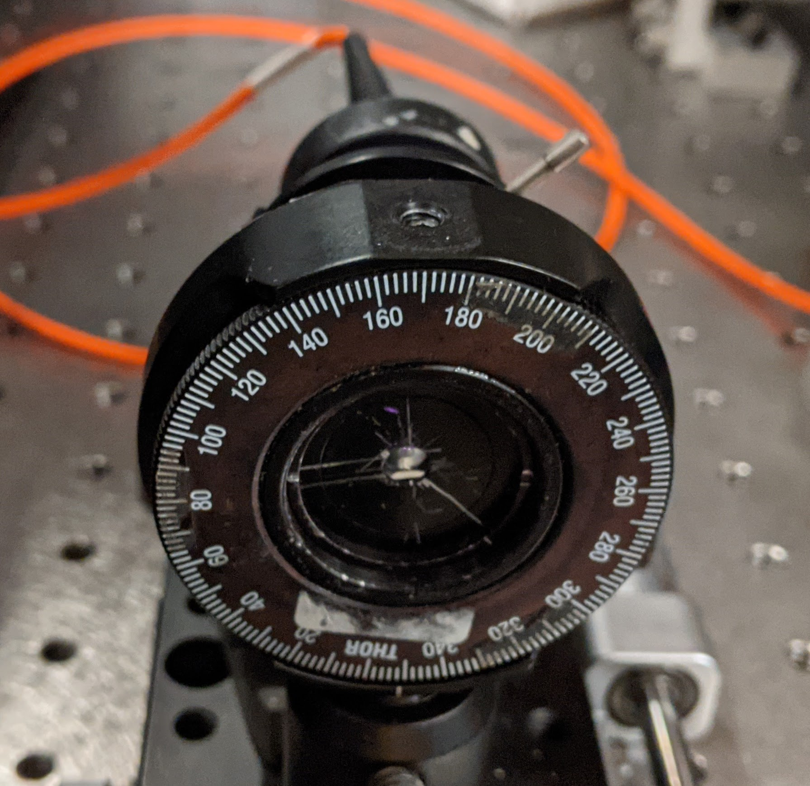
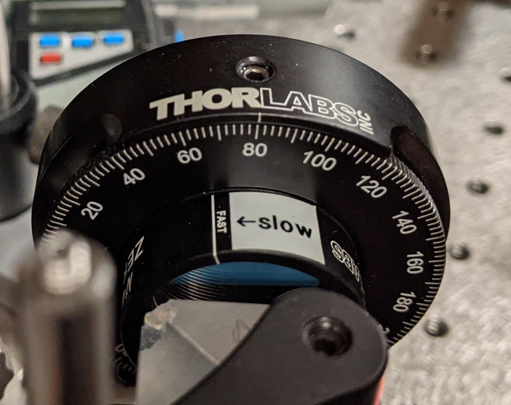

#### Cross-correlation on Pierced sCFG - Run 2
Purpose: Quantify notch temporal profile, improve data quality from run 1

|#|Info|Start [Step] End (mm)|Extra
|:---:|---|---|:---:
|1|Notch 4-fiber|176 [0.4] 186|spectrum_notch, spectrum_probe, bg_cfg, bg_probe
|2|Control|176 [0.4] 186|-
|3|Notch 4-fiber|175 [0.2] 185|-
|4|Control|175 [0.2] 185|-

* Red arm power before waveplate: 180 uJ
* Probe power: 42 uJ (both ND filters are set to no attenuation) 
* Probe zero position: 160 mm

#### Images
||
|:---:|:---:
|BBO crystal|Waveplate
