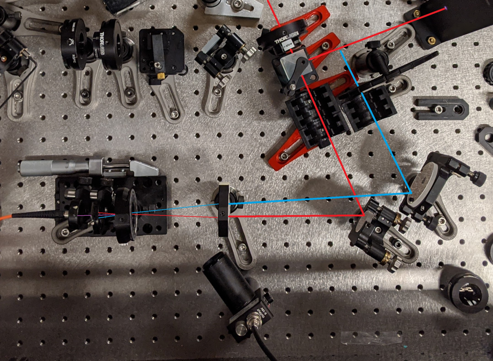
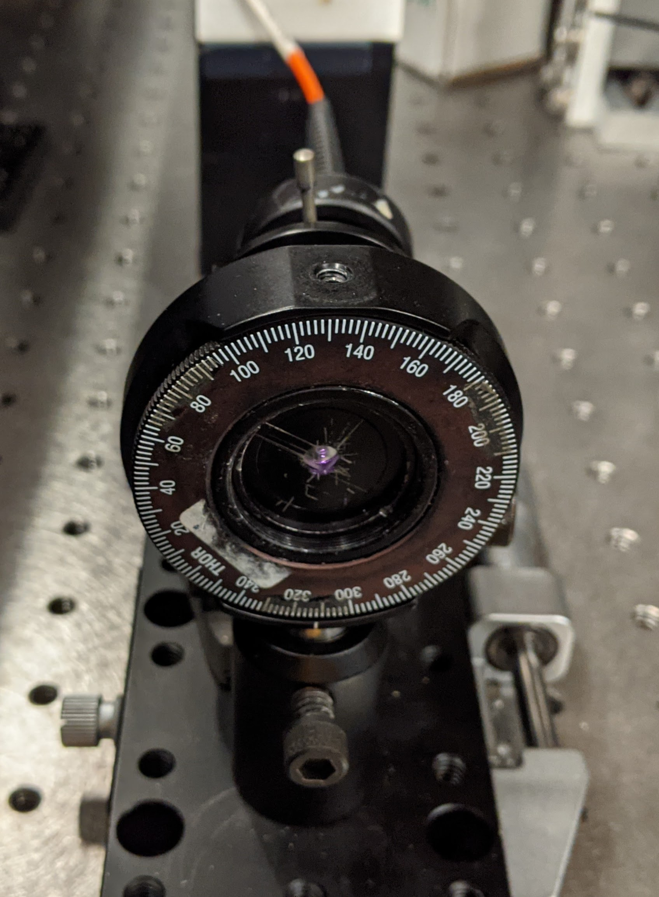
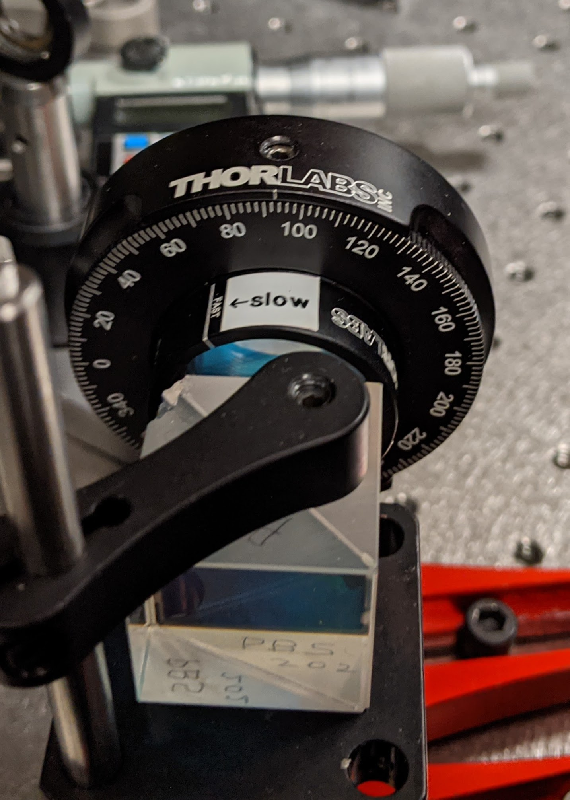
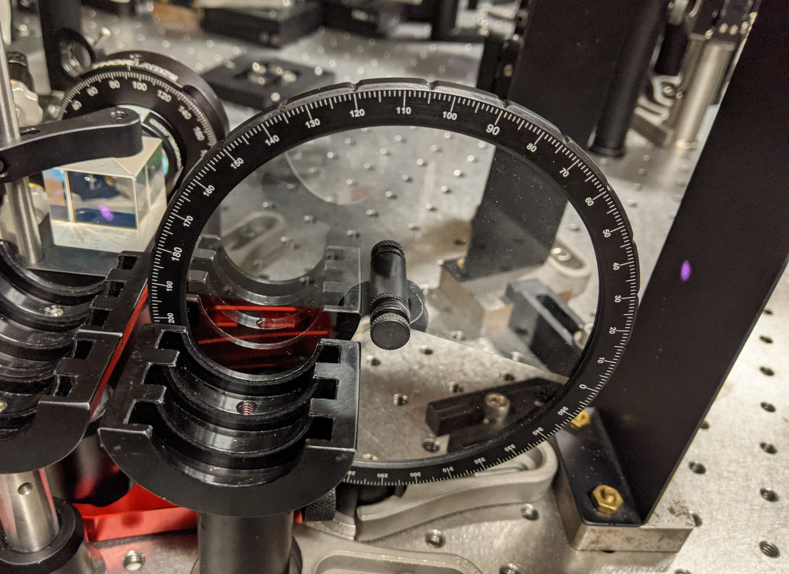

#### Cross-correlation on Pierced sCFG
Purpose: Quantify notch temporal profile

|#|Info|Start [Step] End (mm)|Extra
|:---:|---|---|:---:
|1|Control|160 [1] 240|-
|2|Notch 4-fiber|178 [0.25] 190|spectrum
|3|Control|178 [0.25] 190|-

* Red arm power before waveplate: 180 uJ
* Probe power 42 uJ before ND filter

#### Images
|
|:---:
|Setup top view: centrifuge (red), probe (blue), sum (purple)

|||
|:---:|:---:|:---:
|BBO crystal|Waveplate|Probe ND filter
